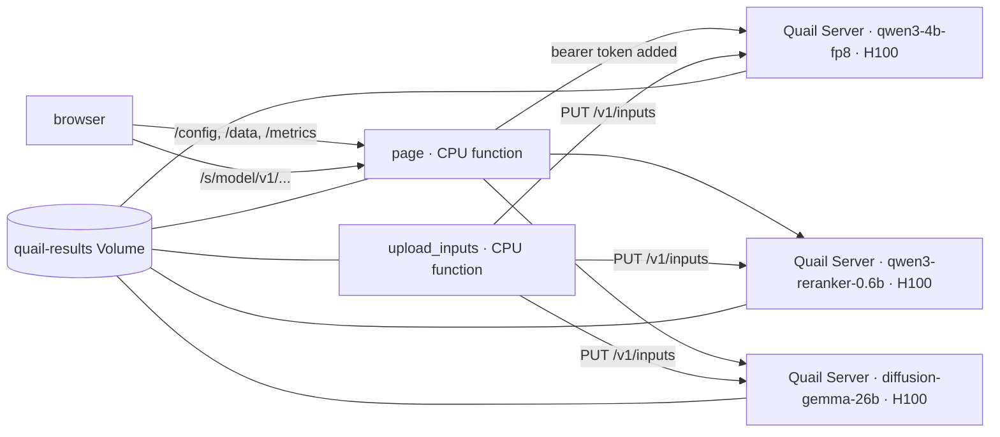

# Quail playground

A web page for demoing [Quail](https://github.com/fsdatalab/quail): four
AI-SQL queries, each running on Quail Server on its own H100 on Modal,
with the answers drawn as they arrive.

| Query | Model | Data |
| --- | --- | --- |
| IMDB · sentiment (`AI.SCORE`) | qwen3-reranker-0.6b-bf16 | 10,000 IMDB reviews: 5,000 labeled negative, then 5,000 positive |
| IMDB · ending + recommends (two `AI.IF` filters) | qwen3-4b-fp8 | the same 10,000 reviews |
| BIO-4 (three filters, two joins on one anchor) | qwen3-4b-fp8 | the quail-bench BIO tables at scale factor 0.1: 500 reports, 1,127 terms |
| Agent trace compaction (one join, the conversation as anchor) | diffusion-gemma-26b-a4b-fp8 | 100 OpenHands trajectories, 6,554 retention questions |

For every query the page shows tokens/second, fresh input tokens,
tokens read from KV, KV regret, and GPU cost, with the definitions
Quail's reports use. KV regret and requested input tokens are computed
by quail-bench (`quail_b.minimum.token_metrics`) from the saved answer
tables after the run; nothing is tracked in the engine loop.

## How it is put together



- The three GPU containers run quail-server as shipped
  (`quail.server.app.create_app`), one model each. Modal takes a memory
  snapshot of each container after a tiny warm-up query has loaded the
  model, so a container that starts later restores the loaded model
  instead of booting it (`playground/servers.py`,
  `playground/modal_app.py`).
- The page is a small Starlette app on a CPU container. It serves the
  static files, forwards `/s/<model>/v1/...` to that model's server with
  the bearer token added, and computes the token numbers of a finished
  query (`playground/web.py`, `playground/regret.py`).
- The input tables are built once by `playground/prepare.py` and
  uploaded to each server through quail-server's own upload route.

## Deploy

Run everything from the repository root. The images copy
`pyproject.toml` and `uv.lock` from the working directory.

```bash
uv sync
modal secret create quail-server-token \
    QUAIL_SERVER_TOKEN=<token> HF_TOKEN=<hugging-face-token>
modal deploy -m playground.modal_app 2>&1 | tee deploy.log
```

`modal deploy` prints four URLs: the page and the three servers. The
page is the one for `page`.

Then build the demo data and hand it to the servers. This downloads
IMDB, the quail-bench BIO corpus, and the sampled trajectories, tokenizes
the reports, and uploads the Arrow files. It takes a few minutes; the
servers start on their first upload, which is also when each takes its
snapshot.

```bash
modal run -m playground.modal_app::prepare 2>&1 | tee prepare.log
```

`prepare` accepts `--groups imdb,bio,compaction` to rebuild some of
the data, `--no-register` to only build, and `--compaction-limit` and
`--compaction-seed` for the trajectory sample. `modal run -m
playground.modal_app::register` uploads data that is already on the
Volume, for example after redeploying the servers. `modal run -m
playground.modal_app::warm` starts every server once, so a snapshot
exists before a demo.

The secret is the same `quail-server-token` that
`quail.server.modal_app` uses. `HF_TOKEN` is needed for DiffusionGemma's
gated weights and tokenizer.

## During a demo

Open the page, pick a query, press Run. Switching to a query pings its
server, so a cold container restores while you talk; the header says
when it is ready. A server stays up for 15 minutes after its last
request (`SCALEDOWN_S` in `playground/modal_app.py`).

The Modal app is `quail-playground`. It shares the `quail-results`,
`quail-hf-cache`, and `quail-kernel-cache` Volumes with the quail
repository's apps, so model weights and compiled kernels are warm on the
first start. It is a separate app because `modal deploy` replaces every
function of the app it deploys to, and the servers here must not
replace `quail-engine`'s.

## Run the page locally

With a Quail Server running somewhere (for example `quail-server` on a
GPU machine, or the deployed one with its token in
`QUAIL_SERVER_TOKEN`) and the data built into a local directory:

```bash
uv run python -c "from pathlib import Path; from playground.prepare import build; build(Path('data'), ['imdb'])"
uv run python -m playground.web --data-dir data --server qwen3-4b-fp8=http://127.0.0.1:8642
```

## Development

```bash
uv run ruff check playground tests tools
uv run pytest -q
```

The tests compile the four queries on a CPU session, check the
quail-bench token counts on tiny tables, and exercise the page's routes
against a fake server. Nothing here needs a GPU.

`pyproject.toml` pins `quail-engine` and `quail-b` to commits. Every
other package is constrained to the versions in quail's own `uv.lock`
at that commit, so the GPU stack is the one quail tests. After moving
the quail pin, refresh the constraints and the lock:

```bash
python tools/constraints_from_quail_lock.py ../quail/uv.lock
uv lock
```

`playground/compaction.py` is copied from quail's
`demos/agent_trace_compaction.py` (MIT), keeping the parts that build
the compaction state and the retention questions.
